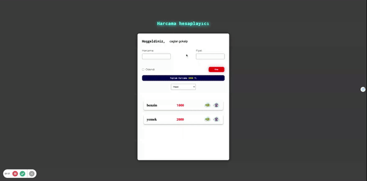

<h1>Harcama Hesaplayıcı</H1>

A dynamic project utilizing HTML5, CSS, and JavaScript is implemented for an expense calculator. Users can input various expenses, and the project includes a filtering feature. Additionally, users can mark expenses as "paid" at a later time and have the ability to delete them. This project is designed to be interactive and offers dynamic functionality for managing and manipulating expenses. 

